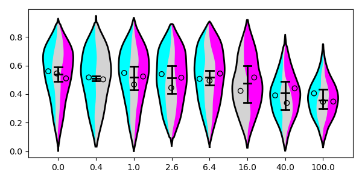

### Superplots for visualizing dense datasets ###

This work builds upon the superplots put forth by Lord, Velle, Mullins, and Fritz-Laylin in ["SuperPlots: Communicating reproducibility and variability in cell biology"](https://doi.org/10.1083/jcb.202001064) (2020). We propose replacing the underlying beeswarm plot with a modified violinplot while keeping the error bars and scatterpoints for each replicate mean/median.

#### To-do list ####
* Add statistics to top of plot, make it an option for the user
* Output statistics (ANOVA and Tukey for normally distributed data; Kruskal and something for someone else)
* Make it idiotproof i.e. create error messages when an argument is invalid
* Re-evaluate histogram stacking implementation if normalization is not already involved

#### Done ####
* Make it work with conditions AND replicates
* Add a palette of pastel colours to make it more palatable
* Implement skeleton plot overlay to show replicate statistics
* Allow users more control over the final visualization
* Make colors part of args.txt
* Allow users to modify default arguments
* Package into a CLI using Click library
