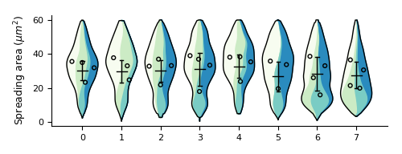

### Superplots for visualizing dense datasets ###

This work builds upon the SuperPlots proposed by Lord et al. in ["SuperPlots: Communicating reproducibility and variability in cell biology"](https://doi.org/10.1083/jcb.202001064) (2020). We propose replacing the underlying beeswarm plot with a modified violinplot while keeping the error bars and scatterpoints for each replicate mean/median. This modified SuperPlot serves to improve readabiliity of dense datasets and allow rapid interpretation of the contribution of cell-level data to the summary statistics.

#### To-do list ####
* Optimize size of scatterpoints

#### Done ####
* Make it work with conditions as well as replicates
* Add a palette of pastel colours to make it more palatable
* Implement skeleton plot overlay to show replicate statistics
* Allow users more control over the final visualization
* Make colors part of args.txt
* Allow users to modify default arguments
* Package into a CLI using Click library
* Add statistics to top of plot and make it optional for the user
* Output statistics (ANOVA and Tukey for normal data; Kruskal and Mann-Whitney for non-normal data)
* Display error messages where appropriate
* Re-evaluate histogram stacking implementation if normalization is not already involved. UPDATE: histograms are normalized and stacking is working
