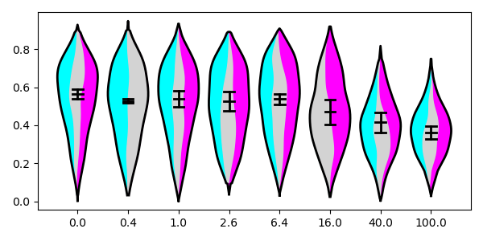

### Superplots for visualizing dense datasets ###

This work builds upon the superplots suggested by Lord, Velle, Mullins, and Fritz-Laylin in ["SuperPlots: Communicating reproducibility and variability in cell biology"](https://doi.org/10.1083/jcb.202001064) (2020). Mean or median values from experimental replicates which rely on large numbers of cells have a certain variability which is lost when a single statistic is chosen to represent these data. This variability is hidden when standard plots are used to display the data. The superplots put forward in the aforementioned paper display individual replicate variability using beeswarm plots (replicate data) overlaid with skeleton plots (overall statistics). While the beeswarm plot emphasizes the variability between replicates and gives an indication of the distribution of the underlying data, it requires more effort on the reader's part to be understood than a simple boxplot.

We propose replacing the underlying beeswarm plot with a modified violinplot while keeping the skeleton plot. The underlying plot consists of an outline violinplot showing the distribution of all of the underlying data . . . *TBC*

#### To-do list ####
* Add statistics to top of plot, make it an option for the user
* Make colors part of args.txt
* Allow users to modify default arguments

#### Done ####
* Make it work with conditions AND replicates
* Add a palette of pastel colours to make it more palatable
* Implement skeleton plot overlay to show replicate statistics
* Allow users more control over the final visualization
* Package into a CLI using Click library
