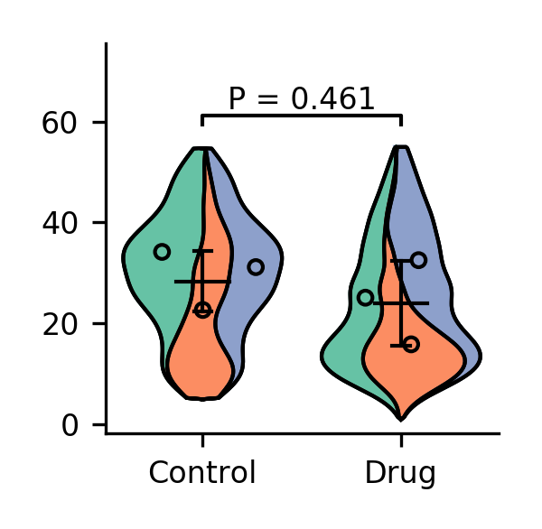

## Violin SuperPlots: Visualising replicate heterogeneity in large datasets ##

This work builds upon the SuperPlots proposed by Lord et al. (2020) in ["SuperPlots: Communicating reproducibility and variability in cell biology"](https://rupress.org/jcb/article/219/6/e202001064/151717/SuperPlots-Communicating-reproducibility-and). We propose replacing the underlying beeswarm plot with a modified violinplot while keeping the error bars and scatterpoints for each replicate mean/median. This modified SuperPlot serves to improve readability of dense datasets and allow rapid interpretation of the contribution of cell-level data to the summary statistics.

Our Violin SuperPlots [editorial](https://www.molbiolcell.org/doi/10.1091/mbc.E21-03-0130) will be made open access approximately 2.5 months after initial publication (expected date: start of October 2021). A free version of the article is made available by our institutional library [here](https://t.co/iFIg79VHwK?amp=1)

Thanks to Streamlit sharing, a [web app](https://bit.ly/374JIyW) is now available which acts as a GUI for the package.

#### Installation and documentation ####
The package can be installed by running `pip install superviolin`. It can be used as a CLI app to generate Violin SuperPlots or imported into your own scripts to allow extension and customization of the `Superviolin` class. The [documentation](https://github.com/kynnemall/superviolin/blob/master/documentation.pdf) is available in the base directory of this repository. Please cite our article if you're using this package for your research.

#### Dependencies ####
- appdirs
- click
- matplotlib
- numpy
- openpyxl
- pandas
- scikit-posthocs
- scipy
- xlrd
